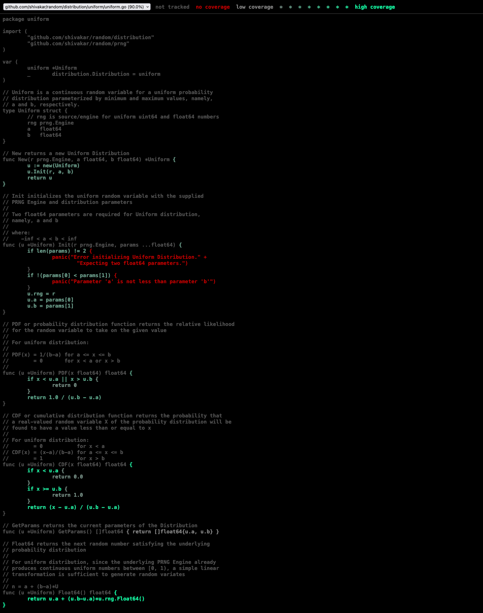

[](https://travis-ci.org/shivakar/random) [](https://coveralls.io/github/shivakar/random?branch=master) [](https://codeclimate.com/github/shivakar/random) [](https://godoc.org/github.com/shivakar/random)

# random
Package random implements pseudo-random number generators and random variate generators.

## Installation

```
go get github.com/shivakar/random
```

## Features

PRNG Engines available:

* Mersenne Twister: mt19937 64-bit
    * See http://www.math.sci.hiroshima-u.ac.jp/~m-mat/MT/emt64.html for
      details and reference implementation
* SplitMix64: Pseduo RNG based on avalanching function
    * See http://prng.di.unimi.it/splitmix64.c for details
      and reference implementation
* Xorshift128Plus: Fast generator passing BigCrush
    * See http://xorshift.di.unimi.it/xorshift128plus.c for details
      and reference implementation
* Xorshift1024Star: Fast generator with maximal period of 2^1024 - 1
    * See http://xorshift.di.unimi.it/xorshift1024star.c for details
      and reference implementation
* Xoroshiro128Plus: The successor to xorshift128+
    * See http://xoroshiro.di.unimi.it/xoroshiro128plus.c for details
      and reference implementation

Random variables and variate generators are available for the following
distributions:

* Continuous Uniform distribution:
    * See https://en.wikipedia.org/wiki/Uniform_distribution_%28continuous%29 for details
* Normal distribution:
    * See https://en.wikipedia.org/wiki/Normal_distribution for details
* LogNormal distribution:
    * See https://en.wikipedia.org/wiki/Log-normal_distribution for details
* Cauchy distribution:
    * See https://en.wikipedia.org/wiki/Cauchy_distribution for details

## Testing and Benchmarks

To run prng long tests that require more than 1e9 random number draws, use command:

```
go test -v -race -cover -covermode=atomic ./prng/<prng> -long -timeout 1h
```

Example:

```
go test -v -race -cover -covermode=atomic ./prng/mt19337 -long -timeout 1h
```

Or use the `Makefile` provided as follows:

```
make mt19937-long
```

Generate coverage report and locally view it using `elinks`:

```
make <prng or distribution>-coverage
```

Example:

```
make uniform-coverage
```

Output:

<a href="assets/uniform-coverage.png"></a>


Test and bench output for posterity:

```
$ go test -v -cover -covermode=atomic -bench . ./...
?   	github.com/shivakar/random	[no test files]
?   	github.com/shivakar/random/distribution	[no test files]
=== RUN   Test_Cauchy_GetParams
--- PASS: Test_Cauchy_GetParams (0.00s)
=== RUN   Test_Cauchy_PDF
--- PASS: Test_Cauchy_PDF (0.00s)
=== RUN   Test_Cauchy_CDF
--- PASS: Test_Cauchy_CDF (0.00s)
=== RUN   Test_Cauchy_Float64
--- PASS: Test_Cauchy_Float64 (0.04s)
=== RUN   ExampleCauchy
--- PASS: ExampleCauchy (0.00s)
goos: darwin
goarch: arm64
pkg: github.com/shivakar/random/distribution/cauchy
Benchmark_BuiltInPRNG_CauchyFloat64
Benchmark_BuiltInPRNG_CauchyFloat64-8         	49134766	        21.83 ns/op
Benchmark_Cauchy_MT19937_Float64
Benchmark_Cauchy_MT19937_Float64-8            	41710718	        28.21 ns/op
Benchmark_Cauchy_SplitMix64_Float64
Benchmark_Cauchy_SplitMix64_Float64-8         	44029762	        26.55 ns/op
Benchmark_Cauchy_Xoroshiro128Plus_Float64
Benchmark_Cauchy_Xoroshiro128Plus_Float64-8   	51687748	        22.88 ns/op
Benchmark_Cauchy_Xorshift128Plus_Float64
Benchmark_Cauchy_Xorshift128Plus_Float64-8    	47147956	        24.93 ns/op
Benchmark_Cauchy_Xorshift1024Star_Float64
Benchmark_Cauchy_Xorshift1024Star_Float64-8   	39433796	        29.67 ns/op
PASS
coverage: 86.7% of statements
ok  	github.com/shivakar/random/distribution/cauchy	7.273s
?   	github.com/shivakar/random/distribution/internal/distribtest	[no test files]
=== RUN   Test_PolyEval
--- PASS: Test_PolyEval (0.00s)
=== RUN   Test_NormICDF
--- PASS: Test_NormICDF (0.00s)
PASS
coverage: 100.0% of statements
ok  	github.com/shivakar/random/distribution/internal/mathutils	0.100s
=== RUN   Test_LogNormal_GetParams
--- PASS: Test_LogNormal_GetParams (0.00s)
=== RUN   Test_LogNormal_PDF
--- PASS: Test_LogNormal_PDF (0.00s)
=== RUN   Test_LogNormal_CDF
--- PASS: Test_LogNormal_CDF (0.00s)
=== RUN   Test_LogNormal_Float64
--- PASS: Test_LogNormal_Float64 (0.12s)
=== RUN   ExampleLogNormal
--- PASS: ExampleLogNormal (0.00s)
goos: darwin
goarch: arm64
pkg: github.com/shivakar/random/distribution/lognormal
Benchmark_BuiltInPRNG_LogNormFloat64
Benchmark_BuiltInPRNG_LogNormFloat64-8           	100000000	        10.80 ns/op
Benchmark_LogNormal_MT19937_Float64
Benchmark_LogNormal_MT19937_Float64-8            	37045088	        31.79 ns/op
Benchmark_LogNormal_SplitMix64_Float64
Benchmark_LogNormal_SplitMix64_Float64-8         	39418467	        29.75 ns/op
Benchmark_LogNormal_Xoroshiro128Plus_Float64
Benchmark_LogNormal_Xoroshiro128Plus_Float64-8   	39440600	        29.51 ns/op
Benchmark_LogNormal_Xorshift128Plus_Float64
Benchmark_LogNormal_Xorshift128Plus_Float64-8    	39729945	        29.47 ns/op
Benchmark_LogNormal_Xorshift1024Star_Float64
Benchmark_LogNormal_Xorshift1024Star_Float64-8   	38525077	        30.71 ns/op
PASS
coverage: 89.5% of statements
ok  	github.com/shivakar/random/distribution/lognormal	7.308s
=== RUN   Test_Normal_GetParams
--- PASS: Test_Normal_GetParams (0.00s)
=== RUN   Test_Normal_CDF
--- PASS: Test_Normal_CDF (0.00s)
=== RUN   Test_Normal_PDF
--- PASS: Test_Normal_PDF (0.00s)
=== RUN   Test_Normal_Float64
--- PASS: Test_Normal_Float64 (0.14s)
=== RUN   ExampleNormal
--- PASS: ExampleNormal (0.00s)
goos: darwin
goarch: arm64
pkg: github.com/shivakar/random/distribution/normal
Benchmark_BuiltInPRNG_NormFloat64
Benchmark_BuiltInPRNG_NormFloat64-8           	257363085	         4.632 ns/op
Benchmark_Normal_MT19937_Float64
Benchmark_Normal_MT19937_Float64-8            	35767732	        32.42 ns/op
Benchmark_Normal_SplitMix64_Float64
Benchmark_Normal_SplitMix64_Float64-8         	38368486	        30.28 ns/op
Benchmark_Normal_Xoroshiro128Plus_Float64
Benchmark_Normal_Xoroshiro128Plus_Float64-8   	38912450	        30.05 ns/op
Benchmark_Normal_Xorshift128Plus_Float64
Benchmark_Normal_Xorshift128Plus_Float64-8    	38469758	        30.02 ns/op
Benchmark_Normal_Xorshift1024Star_Float64
Benchmark_Normal_Xorshift1024Star_Float64-8   	37099489	        31.11 ns/op
PASS
coverage: 87.5% of statements
ok  	github.com/shivakar/random/distribution/normal	7.873s
=== RUN   Test_Uniform_GetParams
--- PASS: Test_Uniform_GetParams (0.00s)
=== RUN   Test_Uniform_CDF
--- PASS: Test_Uniform_CDF (0.00s)
=== RUN   Test_Uniform_PDF
--- PASS: Test_Uniform_PDF (0.00s)
=== RUN   Test_Uniform_Float64
--- PASS: Test_Uniform_Float64 (0.01s)
=== RUN   ExampleUniform
--- PASS: ExampleUniform (0.00s)
goos: darwin
goarch: arm64
pkg: github.com/shivakar/random/distribution/uniform
Benchmark_BuiltInPRNG_Float64
Benchmark_BuiltInPRNG_Float64-8                	494987222	         2.392 ns/op
Benchmark_Uniform_MT19937_Float64
Benchmark_Uniform_MT19937_Float64-8            	153106050	         7.829 ns/op
Benchmark_Uniform_SplitMix64_Float64
Benchmark_Uniform_SplitMix64_Float64-8         	174184448	         6.881 ns/op
Benchmark_Uniform_Xoroshiro128Plus_Float64
Benchmark_Uniform_Xoroshiro128Plus_Float64-8   	173764304	         6.880 ns/op
Benchmark_Uniform_Xorshift128Plus_Float64
Benchmark_Uniform_Xorshift128Plus_Float64-8    	173992126	         6.887 ns/op
Benchmark_Uniform_Xorshift1024Star_Float64
Benchmark_Uniform_Xorshift1024Star_Float64-8   	174063404	         6.887 ns/op
PASS
coverage: 90.0% of statements
ok  	github.com/shivakar/random/distribution/uniform	11.118s
goos: darwin
goarch: arm64
pkg: github.com/shivakar/random/prng
Benchmark_BuiltInPRNG_Int63
Benchmark_BuiltInPRNG_Int63-8     	517982815	         2.264 ns/op
Benchmark_BuiltInPRNG_Float64
Benchmark_BuiltInPRNG_Float64-8   	478866602	         2.341 ns/op
PASS
coverage: [no statements]
ok  	github.com/shivakar/random/prng	2.866s
?   	github.com/shivakar/random/prng/internal/prngtest	[no test files]
2022/06/03 05:57:05 Note: Running tests that require less than 1e9 PRNG draws.
	To run all tests run with -long flag.
=== RUN   Test_MT19937_GetSetSeed
--- PASS: Test_MT19937_GetSetSeed (0.00s)
=== RUN   Test_MT19937_GetSetState
--- PASS: Test_MT19937_GetSetState (0.00s)
=== RUN   Test_MT19937_Uint64
--- PASS: Test_MT19937_Uint64 (0.59s)
=== RUN   Test_MT19937_Float64
--- PASS: Test_MT19937_Float64 (1.30s)
=== RUN   Test_MT19937_Float64OO
--- PASS: Test_MT19937_Float64OO (0.65s)
goos: darwin
goarch: arm64
pkg: github.com/shivakar/random/prng/mt19937
Benchmark_MT19937_Uint64
Benchmark_MT19937_Uint64-8      	85182152	        13.81 ns/op
Benchmark_MT19937_Float64
Benchmark_MT19937_Float64-8     	76847131	        15.36 ns/op
Benchmark_MT19937_Float64OO
Benchmark_MT19937_Float64OO-8   	74261065	        15.37 ns/op
PASS
coverage: 96.6% of statements
ok  	github.com/shivakar/random/prng/mt19937	6.177s
2022/06/03 05:57:12 Note: Running tests that require less than 1e9 PRNG draws.
	To run all tests run with -long flag.
=== RUN   Test_SplitMix64_GetSetSeed
--- PASS: Test_SplitMix64_GetSetSeed (0.00s)
=== RUN   Test_SplitMix64_GetSetState
--- PASS: Test_SplitMix64_GetSetState (0.00s)
=== RUN   Test_SplitMix64_Uint64
--- PASS: Test_SplitMix64_Uint64 (0.30s)
=== RUN   Test_SplitMix64_Float64
--- PASS: Test_SplitMix64_Float64 (0.58s)
=== RUN   Test_SplitMix64_Float64OO
--- PASS: Test_SplitMix64_Float64OO (0.29s)
goos: darwin
goarch: arm64
pkg: github.com/shivakar/random/prng/splitmix64
Benchmark_SplitMix64_Uint64
Benchmark_SplitMix64_Uint64-8      	174118483	         6.883 ns/op
Benchmark_SplitMix64_Float64
Benchmark_SplitMix64_Float64-8     	174083362	         6.881 ns/op
Benchmark_SplitMix64_Float64OO
Benchmark_SplitMix64_Float64OO-8   	174201991	         6.884 ns/op
PASS
coverage: 97.2% of statements
ok  	github.com/shivakar/random/prng/splitmix64	6.956s
2022/06/03 05:57:19 Note: Running tests that require less than 1e9 PRNG draws.
	To run all tests run with -long flag.
=== RUN   Test_xoroshiro128Plus_GetSetSeed
--- PASS: Test_xoroshiro128Plus_GetSetSeed (0.00s)
=== RUN   Test_xoroshiro128Plus_GetSetState
--- PASS: Test_xoroshiro128Plus_GetSetState (0.00s)
=== RUN   Test_xoroshiro128Plus_Uint64
--- PASS: Test_xoroshiro128Plus_Uint64 (0.35s)
=== RUN   Test_xoroshiro128Plus_Float64
--- PASS: Test_xoroshiro128Plus_Float64 (0.88s)
=== RUN   Test_xoroshiro128Plus_Float64OO
--- PASS: Test_xoroshiro128Plus_Float64OO (0.44s)
=== RUN   ExampleXoroshiro128plus
--- PASS: ExampleXoroshiro128plus (0.00s)
goos: darwin
goarch: arm64
pkg: github.com/shivakar/random/prng/xoroshiro128plus
Benchmark_xoroshiro128Plus_Uint64
Benchmark_xoroshiro128Plus_Uint64-8      	147447513	         8.131 ns/op
Benchmark_xoroshiro128Plus_Float64
Benchmark_xoroshiro128Plus_Float64-8     	100000000	        10.33 ns/op
Benchmark_xoroshiro128Plus_Float64OO
Benchmark_xoroshiro128Plus_Float64OO-8   	100000000	        10.32 ns/op
PASS
coverage: 97.8% of statements
ok  	github.com/shivakar/random/prng/xoroshiro128plus	5.885s
2022/06/03 05:57:24 Note: Running tests that require less than 1e9 PRNG draws.
	To run all tests run with -long flag.
=== RUN   Test_Xorshift1024star_GetSetSeed
--- PASS: Test_Xorshift1024star_GetSetSeed (0.00s)
=== RUN   Test_Xorshift1024star_GetSetState
--- PASS: Test_Xorshift1024star_GetSetState (0.00s)
=== RUN   Test_Xorshift1024star_Uint64
--- PASS: Test_Xorshift1024star_Uint64 (0.30s)
=== RUN   Test_Xorshift1024star_Float64
--- PASS: Test_Xorshift1024star_Float64 (0.58s)
=== RUN   Test_Xorshift1024star_Float64OO
--- PASS: Test_Xorshift1024star_Float64OO (0.29s)
goos: darwin
goarch: arm64
pkg: github.com/shivakar/random/prng/xorshift1024star
Benchmark_Xorshift1024star_Uint64
Benchmark_Xorshift1024star_Uint64-8      	174198703	         6.883 ns/op
Benchmark_Xorshift1024star_Float64
Benchmark_Xorshift1024star_Float64-8     	173330251	         6.917 ns/op
Benchmark_Xorshift1024star_Float64OO
Benchmark_Xorshift1024star_Float64OO-8   	173174510	         6.916 ns/op
PASS
coverage: 95.9% of statements
ok  	github.com/shivakar/random/prng/xorshift1024star	6.969s
2022/06/03 05:57:31 Note: Running tests that require less than 1e9 PRNG draws.
	To run all tests run with -long flag.
=== RUN   Test_Xorshift128Plus_GetSetSeed
--- PASS: Test_Xorshift128Plus_GetSetSeed (0.00s)
=== RUN   Test_Xorshift128Plus_GetSetState
--- PASS: Test_Xorshift128Plus_GetSetState (0.00s)
=== RUN   Test_Xorshift128Plus_Uint64
--- PASS: Test_Xorshift128Plus_Uint64 (0.30s)
=== RUN   Test_Xorshift128Plus_Float64
--- PASS: Test_Xorshift128Plus_Float64 (0.58s)
=== RUN   Test_Xorshift128Plus_Float64OO
--- PASS: Test_Xorshift128Plus_Float64OO (0.29s)
goos: darwin
goarch: arm64
pkg: github.com/shivakar/random/prng/xorshift128plus
Benchmark_Xorshift128Plus_Uint64
Benchmark_Xorshift128Plus_Uint64-8      	174225312	         6.883 ns/op
Benchmark_Xorshift128Plus_Float64
Benchmark_Xorshift128Plus_Float64-8     	174144057	         6.886 ns/op
Benchmark_Xorshift128Plus_Float64OO
Benchmark_Xorshift128Plus_Float64OO-8   	174072472	         6.880 ns/op
PASS
coverage: 97.6% of statements
ok  	github.com/shivakar/random/prng/xorshift128plus	6.956s
```

## License

Random is licensed under a MIT license.
